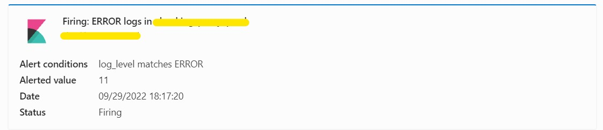

# Kibana Alerting for Free Version

## Description

This project implements a simple kibana->elasticsearch->logstash->MS Teams pipeline for alerting on Elasticsearch log entries.

It is configured for a specific use case with Microsoft Teams, however, feel free to fork the source and update it for any other 3rd party system.

Why this?

- Kibana/Observability provides a way to alert on log entries ([Alert rules and connectors](https://www.elastic.co/guide/en/kibana/current/alerting-getting-started.html)). This is something you might want to use once you have some valuable logging and log parsing configured.

  Of course, one could simply avoid using Kibana UI and directly integrate any tool like logstash to monitor Elasticsearch data and apply some alert conditions from logstash.

  However, I wanted to give a possibility for any qualified user/developer to create alert he/she needs, without the need to deploy/update any resources(and thus potentially break it) in infrastructure.

  Also, Kibana Alert rules provide quite an intuitive way to configure them.

How?

- However, Kibana community edition only provides log and index connectors for integration with notification channels. Leaving only the index connector as a valuable option for any sort of alerting, it was required to configure my way to watch elasticsearch index. Another point to consider was choosing a tool that would have an extensive set of integrations with third parties. A solution to this is [Logstash](https://www.elastic.co/guide/en/logstash/current/output-plugins.html).

  Kibana evaluates the alert rules and writes to the index using the index connector. Logstash periodically monitors the index, and once new data is written it is passed to http output plugin, which is configured for Microsoft Teams alerting.

## Steps

1. [(Optional) Lifecycle Management Policy setup](#optional-index-lifecycle-management)
2. [Configure Kibana Alerts](#kibana-alert-rule-and-connector)
3. [Configure and deploy logstash](#logstash-for-notifications)
4. [(Optional) Deploy logstash and Kibana connector with a script](#optional-deploy-logstash-and-kibana-connector-with-a-script)

## Kibana Alert rule and connector creation

1. Create an Index connector in Kibana Stack Management/Rules and Connectors

   - Write to index `alert-notifications`

2. Create a kibana rule:

   - Check every - 1 minute
   - Notify - Only on status change
   - Log threshold - according to your alerting needs. Can be anything.
   - Actions on alerts:

   ```
   # For Firing
   {
   "summary": "<YOUR SHORT ALERT DESCRIPTION>"
   "rule_id": "{{rule.id}}",
   "rule_name": "{{rule.name}}",
   "date": "{{context.timestamp}}",
   "alert_id": "{{alert.id}}",
   "context_conditions": "{{context.conditions}}",
   "context_matching": "{{context.matchingDocuments}}",
   "alert_status": "Firing"
   }
   # For Resolving
   {
   "summary": "YOUR SHORT ALERT DESCRIPTION"
   "rule_id": "{{rule.id}}",
   "rule_name": "{{rule.name}}",
   "date": "{{context.timestamp}}",
   "alert_id": "{{alert.id}}",
   "context_conditions": "{{context.conditions}}",
   "context_matching": "{{context.matchingDocuments}}",
   "alert_status": "Resolved"
   }
   ```

   - These rule actions can be reused by different alerts and then collected by Logstash
   - Consider setting _summary_ that best describes what the alert is for. As its value will be used in alert notifications later.

## Logstash for notifications

1. Deploy Logstash helm chart with configuration files in:

   - [values.yaml](./values.yaml)
   - [configs/logstash.conf and configs/logstash.yml](./configs/)

   - [upgrade.sh](./upgrade.sh) can be used. (need to set http_proxy variable first)

2. Logstash configuration example:
   ```
   logstashPipeline:
   logstash.conf: |
       input {
       elasticsearch {
           hosts => "${ELASTICSEARCH_HOSTS}"
           ssl => true
           ca_file => "/usr/share/certs/elasticsearch-ca.pem"
           user => "${ELASTICSEARCH_USERNAME}"
           password => "${ELASTICSEARCH_PASSWORD}"
           index => "${ELASTICSEARCH_INPUT_INDEX}"
           query => '{"query":{"range":{"date":{"gte":"now-60s"}}}}'
           schedule => "* * * * *"
           size => 500
           scroll => "1m"
           docinfo => true
           docinfo_target => "[@metadata][doc]"
       }
       }
       filter {
       json {
           source => "message"
       }
       }
       output {
       stdout {}
       http {
           url => "${MICROSOFT_TEAMS_WEBHOOK}"
           proxy => "${HTTP_PROXY}"
           http_method => "post"
           content_type => "json"
           format => "message"
           message => '{"@type":"MessageCard","@context":"http://schema.org/extensions","themeColor":"0076D7","summary":"%{summary}","sections":[{"activityTitle":"%{alert_status}: %{summary} in %{alert_id}","activitySubtitle":"%{alert_id}","activityImage":"https://brandslogos.com/wp-content/uploads/images/large/elastic-kibana-logo.png","facts":[{"name":"Alert conditions","value":"%{context_conditions}"},{"name":"Alerted value","value":"%{context_matching}"},{"name":"Date","value":"%{date}"},{"name":"Status","value":"%{alert_status}"}],"markdown":true}]}'
       }
       }
   ```

- The above configuration has an input plugin, which connects to elasticsearch and reads from the index alias(or index itself) that is provided as an environment variable.
- The read of an index is triggered every 60-70 seconds (From experience setting 60 can result in losing some of the alert notifications. The value may be modified in elasticsearch.query section)
- The output plugin is configured specifically for Microsoft Teams channel. The string in output.http.message is an action card template that creates messages like:
  
- I have commented SSL related parts of logstash configuration [logstash.conf](configs/logstash.conf) & [values.yaml](values.yaml). Uncomment and update them if your Elasticsearch cluster is configured for secure communications.

## (Optional) Deploy Logstash and Kibana connector with a script

There is a simple bash script [deploy.sh](deploy.sh) that can create the Kibana index connector and deploy the logstash for you. However, to use it:

1. Create a .env (Copy the contents of [.env.template](./.env.template))
   Set the values of variables according to your environment.
2. Update the value of ELASTICSEARCH_INPUT_INDEX in [values.yaml](values.yaml) if you set a custom index name in .env.
3. Ensure you have the following software installed:

   - helm
   - curl
   - jq

4. Run the script: `./deploy.sh`

## (Optional) Index lifecycle management

1. Create an index template with a rollover_alias, but no index alias:

   ```
   {
   "template": {
       "settings": {
       "index": {
           "lifecycle": {
           "name": "alert-notifications",
           "rollover_alias": "alert-notifications"
           }
       }
       },
       "mappings": {
       "dynamic": "true",
       "dynamic_date_formats": [
           "strict_date_optional_time",
           "yyyy/MM/dd HH:mm:ss Z||yyyy/MM/dd Z"
       ],
       "dynamic_templates": [],
       "date_detection": true,
       "numeric_detection": false
       },
       "aliases": {}
   }
   }
   ```

2. Create Index Lifecycle Policy to rollover the index based on some criterion and link it to index template.

3. Create a new index with the name of <rollover_alias>-000001 , and set it to point to alias <rollover-alias> and become a write index for it.

   ```
   PUT /alert-notifications-000001
   {
   "aliases": {
       "alert-notifications": {
       "is_write_index": true
       }
   }
   }
   ```
